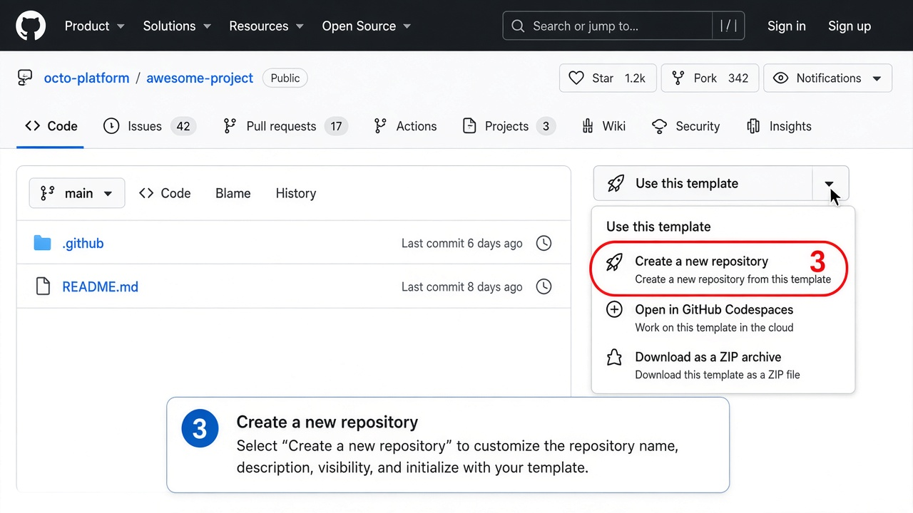
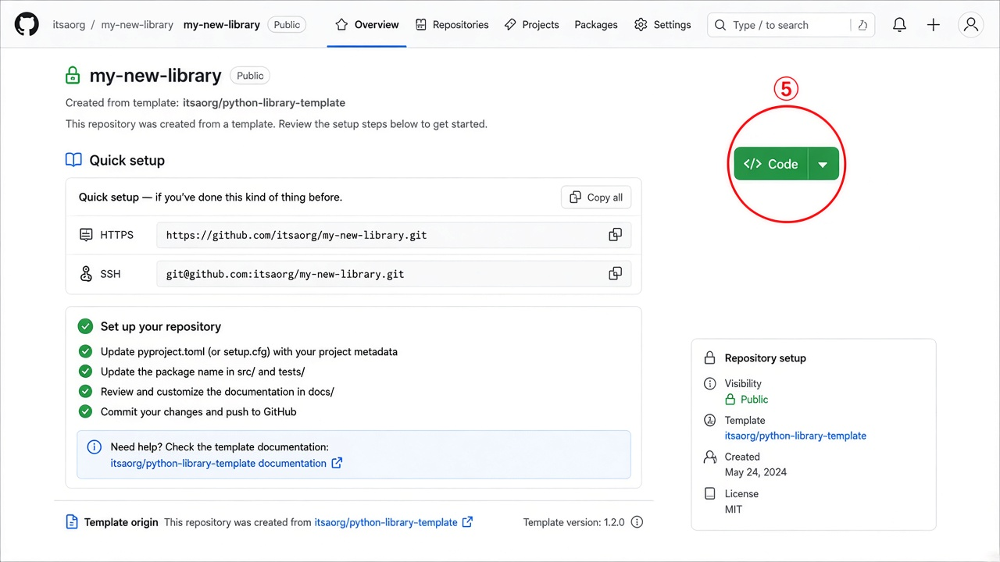

# @itsaorg/ts-blueprint

TypeScript library blueprint and GitHub template. Downstream repos substitute metadata tokens only — no ESLint, TypeScript, Vitest, Husky, or CI reconfiguration.

---

## 📋 Table of Contents

- [🚀 Quickstart](#-quickstart)
- [📸 GitHub template walkthrough (visual guide)](#-github-template-walkthrough-visual-guide)
- [⚡ QuickSetup — GitHub template (gh CLI)](#-quicksetup--github-template-gh-cli)
- [📦 Usage — install from npm](#-usage--install-from-npm)
- [📚 Tutorials](#-tutorials)
- [🗂️ Repository layout](#️-repository-layout)
- [🛠️ Toolchain & DevOps stack](#️-toolchain--devops-stack)
- [✅ Prerequisites](#-prerequisites)
- [📜 npm scripts reference](#-npm-scripts-reference)
- [📄 License](#-license)

---

## 🚀 Quickstart

For developers working in **this repo** locally:

```bash
git clone git@github.com:itsaorg/ts-blueprint.git
cd ts-blueprint
npm install
npm run check
```

Optional: `fnm use` or `nvm use` reads [`.nvmrc`](.nvmrc) (`24.21.0`).

---

## 📸 GitHub template walkthrough (visual guide)

Create a new library repo from this template using the GitHub website.

### Before you start

| Requirement       | Notes                                       |
| ----------------- | ------------------------------------------- |
| GitHub account    | Sign in at [github.com](https://github.com) |
| Node.js ≥ 24.21.0 | Verify with `node -v` after cloning         |
| npm               | Bundled with Node                           |

> **Template vs fork:** **Use this template** creates a fresh repo with a clean history. **Fork** keeps upstream linkage — prefer **template** for new libraries.
>
> **Two paths after GitHub creates your repo:**
>
> - **GitHub template alone** copies the root branch (includes nested `template/`, real `@itsaorg/ts-blueprint` names in this blueprint).
> - **`substitute-names` (recommended)** overlays the portable `template/` snapshot and replaces `__TOKEN__` placeholders with your org/package metadata.

---

### Step 1 — Open the blueprint repository

**Goal:** Navigate to the canonical template source.

**Action:** Open [https://github.com/itsaorg/ts-blueprint](https://github.com/itsaorg/ts-blueprint)

**Expected result:** You see the repo homepage with a **Template repository** badge.


---

### Step 2 — Click **Use this template**

**Goal:** Start creating a new repo from the template.

**Action:** Click the green **Use this template** button (top right).

**Expected result:** A dropdown menu appears.


---

### Step 3 — Choose **Create a new repository**

**Goal:** Open the new-repo creation form (not a fork).

**Action:** Select **Create a new repository** from the dropdown.

**Expected result:** GitHub opens the template creation page.



---

### Step 4 — Configure owner, name, and visibility

**Goal:** Define where the new repo lives and who can see it.

**Action:** Fill in:

| Field           | Example                       |
| --------------- | ----------------------------- |
| Owner           | `itsaorg` (or your org/user)  |
| Repository name | `my-new-library`              |
| Description     | Short summary of your library |
| Visibility      | Public or Private             |

Click **Create repository**.


---

### Step 5 — Confirm the new repository

**Goal:** Verify GitHub created the repo from the template.

**Action:** Review the empty-repo quickstart page. Note the **Code** button for cloning.

**Expected result:** A new repo under your chosen owner with this template's file tree.



---

### Step 6 — Clone locally and verify

**Goal:** Install dependencies and pass the quality gate.

**Action:**

```bash
git clone git@github.com:<org>/<new-repo>.git
cd <new-repo>
npm install
npm run check
```

**Expected result:** All lint, format, typecheck, test, and build checks pass.


---

### Step 7 — Finalize metadata (recommended)

**Goal:** Replace blueprint tokens with your package metadata.

**Action:**

```bash
node scripts/substitute-names.mjs \
  --repo <name> \
  --package @scope/name \
  --description "My library" \
  --repo-id R1 \
  --phase P0 \
  --out .
npm install && npm run check
```

**Expected result:** `package.json`, README, and related files reflect your org/package names.

---

### Step 8 — Verify repository layout

**Goal:** Confirm the expected folder structure, including `types/`.

```text
<your-repo>/
├── config/                 # Toolchain configs
├── src/                    # Library source
├── types/                  # Public .d.ts (placeholder → regenerated by build)
├── tests/                  # Unit, integration, consumer tests
├── scripts/                # Validation scripts
├── docs/                   # Variant notes + walkthrough assets
├── .github/                # CI, actions, issue/PR templates
├── .husky/                 # Git hooks
├── .changeset/             # Release management
└── package.json
```

---

### Step 9 — Next steps

| Task                  | Where                                                                       |
| --------------------- | --------------------------------------------------------------------------- |
| Issue-first workflow  | [CONTRIBUTING § 2](CONTRIBUTING.md#2-issue-first-workflow)                  |
| Git Flow branches     | [CONTRIBUTING § 3](CONTRIBUTING.md#3-git-flow-branch-usage)                 |
| Changesets & releases | [CONTRIBUTING § 5](CONTRIBUTING.md#5-changesets-changelog-and-release-flow) |
| Staged npm publish    | [CONTRIBUTING § 7](CONTRIBUTING.md#7-staged-npm-publish-approval-sop)       |

---

## ⚡ QuickSetup — GitHub template (gh CLI)

```bash
gh repo create <org>/<new-repo> --template itsaorg/ts-blueprint --public
git clone git@github.com:<org>/<new-repo>.git
cd <new-repo>
node scripts/substitute-names.mjs \
  --repo <name> \
  --package @scope/name \
  --description "My library" \
  --repo-id R1 \
  --phase P0 \
  --out .
npm install && npm run check
```

See [CONTRIBUTING.md](CONTRIBUTING.md) for Git Flow init, issue-first workflow, and release steps.

---

## 📦 Usage — install from npm

For **consumers** installing the published package:

```bash
npm install @itsaorg/ts-blueprint
```

```typescript
import { getBlueprintHealth } from '@itsaorg/ts-blueprint';
```

Package page: [https://www.npmjs.com/package/@itsaorg/ts-blueprint](https://www.npmjs.com/package/@itsaorg/ts-blueprint)

---

## 📚 Tutorials

| Topic                  | Where to read                                                                            |
| ---------------------- | ---------------------------------------------------------------------------------------- |
| Issue-first workflow   | [CONTRIBUTING § 2](CONTRIBUTING.md#2-issue-first-workflow)                               |
| Git Flow branches      | [CONTRIBUTING § 3](CONTRIBUTING.md#3-git-flow-branch-usage)                              |
| Changesets & changelog | [CONTRIBUTING § 5](CONTRIBUTING.md#5-changesets-changelog-and-release-flow)              |
| Staged npm publish     | [CONTRIBUTING § 7](CONTRIBUTING.md#7-staged-npm-publish-approval-sop)                    |
| Local development      | [CONTRIBUTING § 8](CONTRIBUTING.md#8-local-quality-gate)                                 |
| npm publish auth setup | [CONTRIBUTING § 7.1](CONTRIBUTING.md#71-maintainer-setup-trusted-publisher--stage-token) |

---

## 🗂️ Repository layout

```text
ts-blueprint/
├── config/                 # Toolchain configs (ESLint, TS, Vitest, Prettier, TypeDoc)
├── src/                    # Library source
├── types/                  # Public .d.ts declarations (placeholder → regenerated by build)
├── tests/                  # Unit, integration, consumer tests
├── scripts/                # Validation and scaffold scripts
├── template/               # Portable downstream mirror (__TOKEN__ placeholders)
├── docs/                   # Variant notes + GitHub template walkthrough assets
├── .github/                # CI, composite actions, issue/PR templates
├── .husky/                 # Git hooks
├── .changeset/             # Changesets release management
└── package.json            # npm scripts and metadata
```

### Why `template/` exists

| Mechanism                    | Role                                                                                                                              |
| ---------------------------- | --------------------------------------------------------------------------------------------------------------------------------- |
| **GitHub Template**          | Copies the default branch when you click **Use this template**                                                                    |
| **`template/` subdirectory** | Portable layout with `__REPO_NAME__`, `__PACKAGE_NAME__`, etc. for [`scripts/substitute-names.mjs`](scripts/substitute-names.mjs) |

R0-only scripts (`smoke:scaffold`, nested `template/`) stay at the repo root. The `template/` folder is the canonical portable snapshot for downstream repos.

---

## 🛠️ Toolchain & DevOps stack

Every tool below is preconfigured — scaffolded repos inherit it unchanged.

### ⚙️ Runtime

| Tool              | Role                         | Config / verify                                 |
| ----------------- | ---------------------------- | ----------------------------------------------- |
| Node.js ≥ 24.21.0 | Runtime & npm scripts        | [`.nvmrc`](.nvmrc), `engines` in `package.json` |
| npm               | Package manager & CI install | `npm ci`, `npm run check`                       |

### 📘 Language

| Tool           | Role                                             | Config / script                                                                      |
| -------------- | ------------------------------------------------ | ------------------------------------------------------------------------------------ |
| TypeScript 5.x | Strict ESM compile (`src/` → `dist/` + `types/`) | [`config/tsconfig.json`](config/tsconfig.json), `npm run build`, `npm run typecheck` |

### 🧹 Lint & format

| Tool                   | Role                              | Config / script                                                        |
| ---------------------- | --------------------------------- | ---------------------------------------------------------------------- |
| ESLint 9               | Lint TS/JS with type-aware rules  | [`config/eslint.config.js`](config/eslint.config.js), `npm run lint`   |
| typescript-eslint      | TS-specific ESLint rules          | `config/eslint.config.js`                                              |
| eslint-config-prettier | Disable ESLint/Prettier conflicts | `config/eslint.config.js`                                              |
| Prettier               | Code & markdown formatting        | [`config/.prettierrc.json`](config/.prettierrc.json), `npm run format` |

### ✅ Testing

| Tool                  | Role                       | Config / script                                                                                 |
| --------------------- | -------------------------- | ----------------------------------------------------------------------------------------------- |
| Vitest                | Unit & integration tests   | [`config/vitest.config.ts`](config/vitest.config.ts), `npm run test`                            |
| @vitest/coverage-v8   | 80% coverage thresholds    | `npm run test:coverage`                                                                         |
| Consumer import tests | Verify ESM package exports | [`config/vitest.consumer.config.ts`](config/vitest.consumer.config.ts), `npm run test:consumer` |

### 🪝 Git hooks

| Tool                    | Role                                   | Config / script                                                              |
| ----------------------- | -------------------------------------- | ---------------------------------------------------------------------------- |
| Husky                   | pre-commit, commit-msg, pre-push hooks | [`.husky/`](.husky/)                                                         |
| lint-staged             | Format/lint staged files               | `package.json` → `lint-staged`, `pre-commit` hook                            |
| check-staged-file-limit | Max 5 staged files per commit          | [`scripts/check-staged-file-limit.mjs`](scripts/check-staged-file-limit.mjs) |

### 📝 Commits

| Tool                            | Role                         | Config / script                                                                 |
| ------------------------------- | ---------------------------- | ------------------------------------------------------------------------------- |
| Commitlint                      | Enforce Conventional Commits | [`config/commitlint.config.js`](config/commitlint.config.js), `commit-msg` hook |
| @commitlint/config-conventional | feat/fix/docs/chore types    | `config/commitlint.config.js`                                                   |

### 📚 Docs

| Tool    | Role                        | Config / script                                              |
| ------- | --------------------------- | ------------------------------------------------------------ |
| TypeDoc | API reference → `docs/api/` | [`config/typedoc.json`](config/typedoc.json), `npm run docs` |

### 🚀 Release

| Tool               | Role                             | Config / script                                                                     |
| ------------------ | -------------------------------- | ----------------------------------------------------------------------------------- |
| Changesets         | Semver bumps & CHANGELOG         | [`.changeset/`](.changeset/), `npm run changeset`                                   |
| Staged npm publish | CI stages; human approves on npm | [`scripts/stage-publish.mjs`](scripts/stage-publish.mjs), `npm run changeset:stage` |

### 🤖 CI/CD

| Tool              | Role                            | Config                                                           |
| ----------------- | ------------------------------- | ---------------------------------------------------------------- |
| GitHub Actions    | CI on push/PR (`npm run check`) | [`.github/workflows/ci.yml`](.github/workflows/ci.yml)           |
| changesets/action | Version PR + publish on `main`  | [`.github/workflows/publish.yml`](.github/workflows/publish.yml) |
| Composite actions | npm stage/publish steps         | [`.github/actions/`](.github/actions/)                           |

### 🔍 Quality gates

| Script               | Role                                                          |
| -------------------- | ------------------------------------------------------------- |
| `check:layout`       | One principal export per source file                          |
| `check:types-mirror` | Verify `types/` matches public API                            |
| `check:tarball`      | Inspect npm tarball contents                                  |
| `check`              | Full gate (lint → format → typecheck → test → build → checks) |

### 🧰 Optional

| Tool              | Role                                 |
| ----------------- | ------------------------------------ |
| GitHub CLI (`gh`) | Template creation, secrets, releases |
| git-flow AVH      | Branch workflow per CONTRIBUTING     |

---

## ✅ Prerequisites

| Requirement             | Verify             |
| ----------------------- | ------------------ |
| Node.js ≥ 24.21.0       | `node -v`          |
| npm                     | `npm -v`           |
| GitHub CLI (optional)   | `gh auth status`   |
| git-flow AVH (optional) | `git flow version` |

CI runs a single Node **24.21.0** job (`check (Node 24.21.0)`).

---

## 📜 npm scripts reference

Every script below is inherited unchanged by scaffolded repos (except R0-only scripts noted).

| Script                                                | Purpose                                              |
| ----------------------------------------------------- | ---------------------------------------------------- |
| `build`                                               | Compile ESM to `dist/` and declarations to `types/`  |
| `clean`                                               | Remove build, coverage, and generated docs artifacts |
| `typecheck`                                           | TypeScript check without emit                        |
| `lint` / `lint:fix`                                   | ESLint (`config/eslint.config.js`)                   |
| `format` / `format:check`                             | Prettier                                             |
| `test` / `test:watch` / `test:coverage`               | Vitest (80% coverage thresholds)                     |
| `test:consumer`                                       | ESM consumer import test                             |
| `docs`                                                | TypeDoc to `docs/api/`                               |
| `check:layout`                                        | One principal export per source file                 |
| `check:types-mirror`                                  | Verify `types/` matches public API                   |
| `check:tarball`                                       | Inspect npm tarball contents                         |
| `check`                                               | Full local/CI gate (matches Husky `pre-push`)        |
| `changeset` / `changeset:version` / `changeset:stage` | Release management (CI stages via `changeset:stage`) |
| `smoke:scaffold`                                      | **R0-only** — end-to-end template validation         |

```bash
npm run check
```

Husky hooks: `pre-commit` (lint-staged, max 5 staged files), `commit-msg` (Commitlint), `pre-push` (`npm run check`). Details in [CONTRIBUTING § 9](CONTRIBUTING.md#9-husky-hooks-and-git-flow-coexistence).

---

## 📄 License

Apache-2.0 — see [LICENSE](LICENSE).

Release history: [CHANGELOG.md](CHANGELOG.md).
