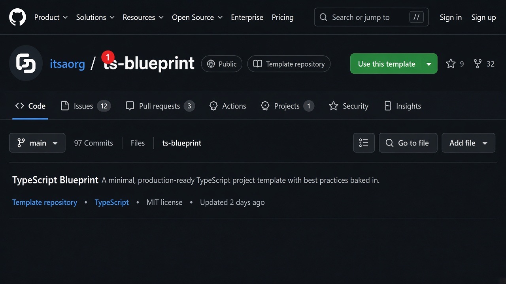
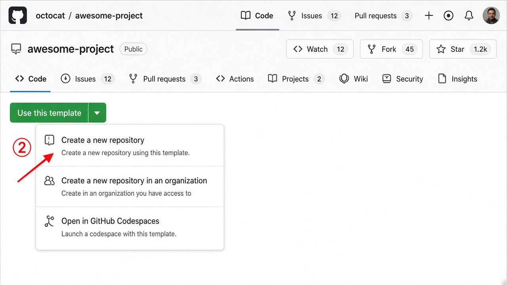
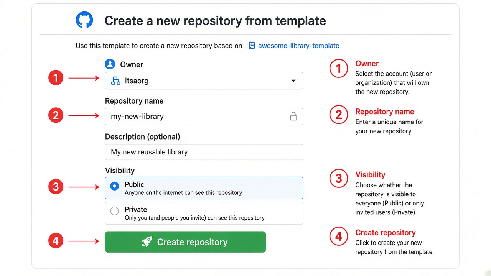
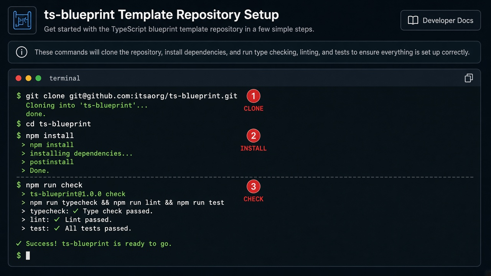

# **PACKAGE_NAME**

TypeScript library blueprint scaffolded from [ts-blueprint](https://github.com/itsaorg/ts-blueprint). Toolchain configs live in `config/` — substitute metadata tokens only.

---

## 📋 Table of Contents

- [🚀 Quickstart](#-quickstart)
- [📸 GitHub template walkthrough (visual guide)](#-github-template-walkthrough-visual-guide)
- [📦 Usage — install from npm](#-usage--install-from-npm)
- [📚 Tutorials](#-tutorials)
- [🗂️ Repository layout](#️-repository-layout)
- [🛠️ Toolchain & DevOps stack](#️-toolchain--devops-stack)
- [✅ Prerequisites](#-prerequisites)
- [📜 npm scripts reference](#-npm-scripts-reference)
- [📄 License](#-license)

---

## 🚀 Quickstart

```bash
git clone git@github.com:__GITHUB_ORG__/__REPO_NAME__.git
cd __REPO_NAME__
npm install
npm run check
```

Optional: `fnm use` or `nvm use` reads [`.nvmrc`](.nvmrc) (`24.21.0`).

---

## 📸 GitHub template walkthrough (visual guide)

Create a new library repo from the upstream blueprint at [itsaorg/ts-blueprint](https://github.com/itsaorg/ts-blueprint).

### Before you start

| Requirement | Notes |
| --- | --- |
| GitHub account | Sign in at [github.com](https://github.com) |
| Node.js ≥ 24.21.0 | Verify with `node -v` after cloning |

> **Template vs fork:** **Use this template** creates a fresh repo. **Fork** keeps upstream linkage — prefer **template** for new libraries.

> **Two paths after GitHub creates your repo:**
>
> - **GitHub template alone** copies the root branch (includes nested `template/`).
> - **`substitute-names` (recommended)** overlays the portable `template/` snapshot and replaces `__TOKEN__` placeholders.

---

### Step 1 — Open the blueprint repository

Open [https://github.com/itsaorg/ts-blueprint](https://github.com/itsaorg/ts-blueprint)



---

### Step 2 — Click **Use this template**

Click the green **Use this template** button (top right).



---

### Step 3 — Choose **Create a new repository**

Select **Create a new repository** from the dropdown.


---

### Step 4 — Configure owner, name, and visibility

Fill in owner, repository name, description, and visibility. Click **Create repository**.



---

### Step 5 — Confirm the new repository

Review the empty-repo quickstart page.


---

### Step 6 — Clone locally and verify

```bash
git clone git@github.com:__GITHUB_ORG__/__REPO_NAME__.git
cd __REPO_NAME__
npm install
npm run check
```



---

### Step 7 — Finalize metadata (recommended)

```bash
node scripts/substitute-names.mjs \
  --repo __REPO_NAME__ \
  --package __PACKAGE_NAME__ \
  --description "__PACKAGE_DESCRIPTION__" \
  --repo-id __REPO_ID__ \
  --phase __MVP_PHASE__ \
  --out .
npm install && npm run check
```

---

### Step 8 — Verify repository layout

```text
__REPO_NAME__/
├── config/
├── src/
├── types/                  # Public .d.ts (placeholder → regenerated by build)
├── tests/
├── scripts/
├── docs/
├── .github/
├── .husky/
├── .changeset/
└── package.json
```

---

### Step 9 — Next steps

See [CONTRIBUTING.md](CONTRIBUTING.md) for Git Flow, changesets, and staged publish SOP.

---

## 📦 Usage — install from npm

```bash
npm install __PACKAGE_NAME__
```

```typescript
import { getBlueprintHealth } from '__PACKAGE_NAME__';
```

Package page: `https://www.npmjs.com/package/__PACKAGE_NAME__`

---

## 📚 Tutorials

| Topic | Where to read |
| --- | --- |
| Issue-first workflow | [CONTRIBUTING § 2](CONTRIBUTING.md#2-issue-first-workflow) |
| Git Flow branches | [CONTRIBUTING § 3](CONTRIBUTING.md#3-git-flow-branch-usage) |
| Changesets & changelog | [CONTRIBUTING § 5](CONTRIBUTING.md#5-changesets-changelog-and-release-flow) |
| Staged npm publish | [CONTRIBUTING § 7](CONTRIBUTING.md#7-staged-npm-publish-approval-sop) |
| Local development | [CONTRIBUTING § 8](CONTRIBUTING.md#8-local-quality-gate) |

---

## 🗂️ Repository layout

```text
__REPO_NAME__/
├── config/                 # Toolchain configs
├── src/                    # Library source
├── types/                  # Public .d.ts declarations (placeholder → regenerated by build)
├── tests/                  # Unit, integration, consumer tests
├── scripts/                # Validation scripts
├── docs/                   # Variant notes + walkthrough assets
├── .github/                # CI, actions, issue/PR templates
├── .husky/                 # Git hooks
├── .changeset/             # Release management
└── package.json
```

---

## 🛠️ Toolchain & DevOps stack

Every tool below is preconfigured — no reconfiguration needed after scaffolding.

### ⚙️ Runtime

| Tool | Role | Config / verify |
| --- | --- | --- |
| Node.js ≥ 24.21.0 | Runtime & npm scripts | [`.nvmrc`](.nvmrc), `engines` in `package.json` |
| npm | Package manager | `npm ci`, `npm run check` |

### 📘 Language

| Tool | Role | Config / script |
| --- | --- | --- |
| TypeScript 5.x | Strict ESM compile | [`config/tsconfig.json`](config/tsconfig.json), `npm run build` |

### 🧹 Lint & format

| Tool | Role | Config / script |
| --- | --- | --- |
| ESLint 9 | Lint TS/JS | [`config/eslint.config.js`](config/eslint.config.js), `npm run lint` |
| Prettier | Formatting | [`config/.prettierrc.json`](config/.prettierrc.json), `npm run format` |

### ✅ Testing

| Tool | Role | Config / script |
| --- | --- | --- |
| Vitest | Unit & integration tests | [`config/vitest.config.ts`](config/vitest.config.ts), `npm run test` |
| Consumer tests | ESM export verification | `npm run test:consumer` |

### 🪝 Git hooks

| Tool | Role | Config |
| --- | --- | --- |
| Husky | pre-commit, commit-msg, pre-push | [`.husky/`](.husky/) |
| lint-staged | Format/lint staged files | `package.json` → `lint-staged` |

### 📝 Commits

| Tool | Role | Config |
| --- | --- | --- |
| Commitlint | Conventional Commits | [`config/commitlint.config.js`](config/commitlint.config.js) |

### 📚 Docs

| Tool | Role | Config / script |
| --- | --- | --- |
| TypeDoc | API reference | [`config/typedoc.json`](config/typedoc.json), `npm run docs` |

### 🚀 Release

| Tool | Role | Config / script |
| --- | --- | --- |
| Changesets | Semver & CHANGELOG | [`.changeset/`](.changeset/), `npm run changeset` |
| Staged publish | CI stages; human approves | `npm run changeset:stage` |

### 🤖 CI/CD

| Tool | Role | Config |
| --- | --- | --- |
| GitHub Actions | CI & publish | [`.github/workflows/`](.github/workflows/) |

### 🔍 Quality gates

| Script | Role |
| --- | --- |
| `check:layout` | One principal export per source file |
| `check:types-mirror` | Verify `types/` matches public API |
| `check:tarball` | Inspect npm tarball contents |
| `check` | Full local/CI gate |

---

## ✅ Prerequisites

| Requirement | Verify |
| --- | --- |
| Node.js ≥ 24.21.0 | `node -v` |
| npm | `npm -v` |

CI runs a single Node **24.21.0** job (`check (Node 24.21.0)`).

---

## 📜 npm scripts reference

| Script | Purpose |
| --- | --- |
| `build` | Compile ESM to `dist/` and declarations to `types/` |
| `check` | Full local/CI gate |
| `changeset` / `changeset:version` / `changeset:stage` | Release management |

```bash
npm run check
```

See [CONTRIBUTING.md](CONTRIBUTING.md) for Git Flow, changesets, and staged publish SOP.

---

## 📄 License

Apache-2.0 — see [LICENSE](LICENSE).

Release history: [CHANGELOG.md](CHANGELOG.md).
